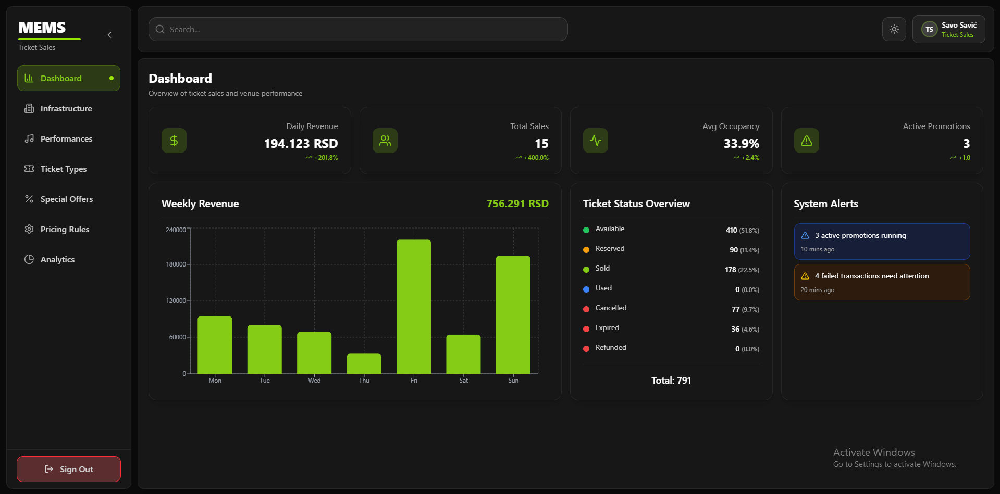
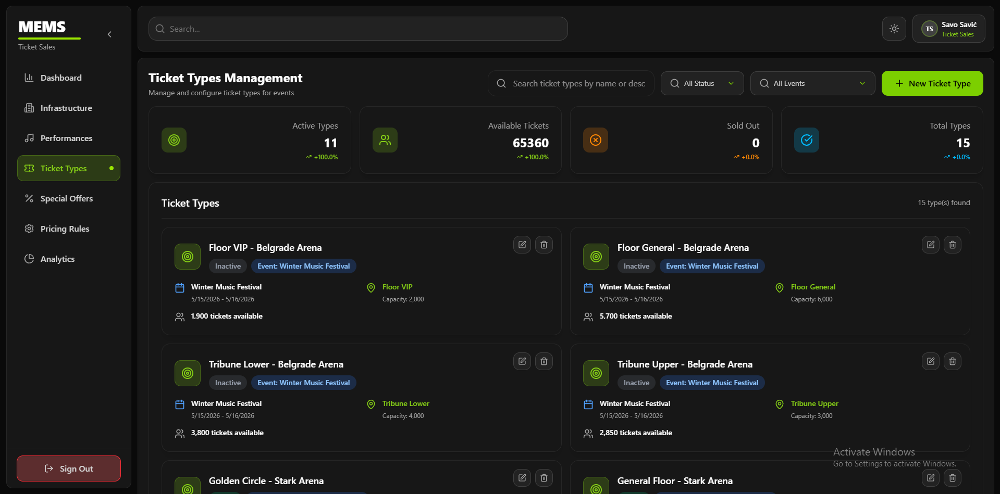
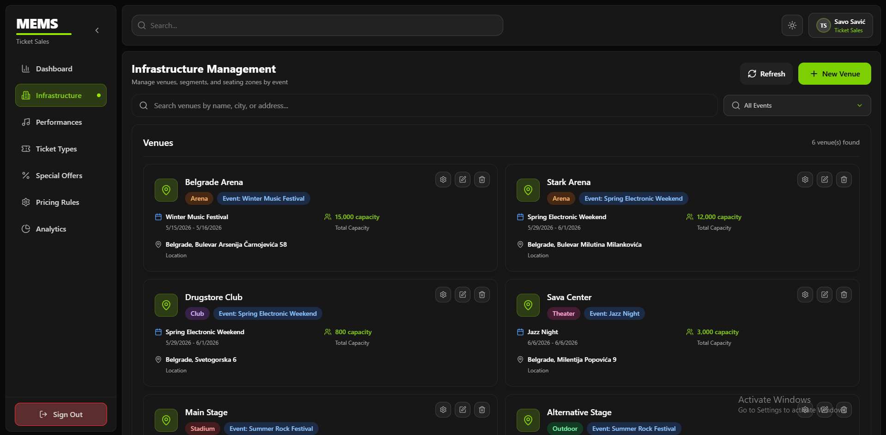
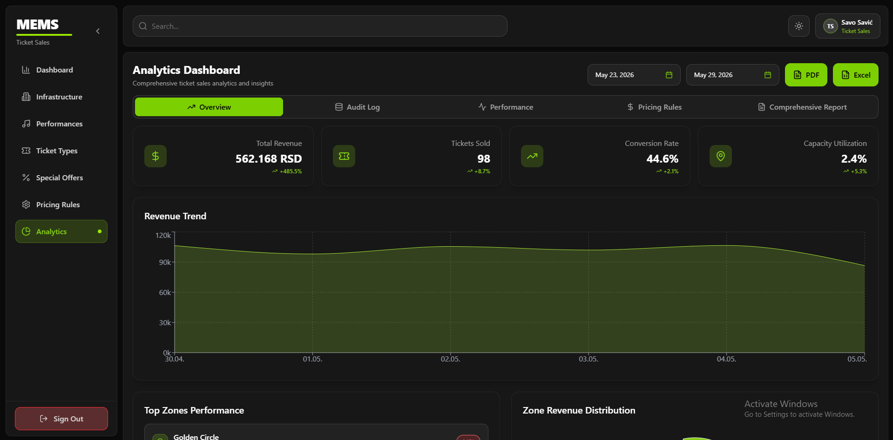

# MEMS – Music Event Management System

> Information system for managing the organization of music events.



---

## About the Project

**MEMS (Music Event Management System)** is a complete information system designed for companies that organize music events. The system centralizes the management of ticket sales, event organization, artist communication, and media campaign management.

The project was developed as part of the **Information Systems Engineering** course.

**Authors:** Savo Savić, Miloš Trivković, Tijana Lazić, Marina Khan

---

## Subsystems

MEMS consists of four integrated subsystems:

| Subsystem | Description |
|-----------|-------------|
| **Ticket Sales** | Dynamic pricing, venue/segment/zone management, ticket types, special offers, sales analytics |
| **Event Organization** | Resource management, performer schedules, workflows, event calendar |
| **Artist Communication** | Artist database, negotiation phases, contract generation, document management |
| **Media Campaign** | Ad type catalog, campaign creation and approval, social media integration |

---

## Ticket Sales Subsystem

> This subsystem was developed by **Savo Savić**.

### Features

- **Infrastructure Management** – creating and managing venues, segments, and zones with capacities and access types
- **Ticket Types** – defining categories (Standard, VIP, Student, Group, Promo) with prices and access rights
- **Special Offers** – promotional deals with conditions and validity periods (e.g. "Buy 3, Get 1 Free")
- **Dynamic Pricing** – automatic price adjustments based on demand, remaining capacity, and time until the event
- **Ticket Sales** – online and physical sales, support for card and cash payments, issuing electronic and physical tickets
- **Analytics & Reports** – sales statistics by event, zone, ticket type, and period; analytical reports generated using PL/pgSQL stored procedures; database triggers implemented for key events; export to PDF and Excel
- **Client Side** – customers can browse and search events, purchase tickets, view and download their tickets

### Screenshots

| Dashboard | Ticket Types Management |
|-----------|------------------------|
|  |  |

| Infrastructure Management | Analytics |
|--------------------------|-----------|
|  |  |

---

## Tech Stack

| Layer | Technology |
|-------|-----------|
| **Frontend** | React + TypeScript |
| **Backend** | C# (.NET) – ASP.NET Core Web API |
| **Database** | PostgreSQL 15+ |
| **Database Logic** | PL/pgSQL (stored procedures, triggers) |
| **Communication** | REST API, JSON, HTTPS / TLS 1.3 |
| **Real-time** | WebSocket |
| **Auth** | JWT, bcrypt (hash + salt), MFA for administrators |

---

## Running the Project

### Prerequisites

- [.NET 8 SDK](https://dotnet.microsoft.com/download)
- [Node.js 18+](https://nodejs.org/)
- [PostgreSQL 15+](https://www.postgresql.org/)

### Backend

```bash
cd backend
dotnet restore
dotnet run
```

The API will be available at `https://localhost:5001`.

### Frontend

```bash
cd frontend
npm install
npm run dev
```

The application will be available at `http://localhost:5173`.

### Database

```bash
# Create the database
createdb mems_db

# Run migrations
cd backend
dotnet ef database update
```

---

## Project Structure

```
MusicEventManagementSystem/
├── MusicEventManagementSystem.API/          # ASP.NET Core Web API – controllers, middleware, configuration
├── MusicEventManagementSystem.Client/       # React TypeScript frontend application
├── MusicEventManagementSystem.Core/         # Domain models, interfaces, business logic
├── MusicEventManagementSystem.EventOr.../   # Event organization subsystem
├── MusicEventManagementSystem.Infrastru.../ # Infrastructure layer – repositories, EF Core, database
├── MusicEventManagementSystem.TicketSa.../  # Ticket sales subsystem
├── MusicEventManagementSystem.sln           # Visual Studio solution file
└── README.md
```

---

## 📄 Documentation

The detailed software requirements specification is available at [`docs/IIS_specifikacija_tim_6.pdf`](docs/IIS_specifikacija_tim_6.pdf).

---

## Author

**GitHub:** [github.com/sav0sav1c5/](https://github.com/sav0sav1c5)

Faculty project — *Information Systems Engineering*